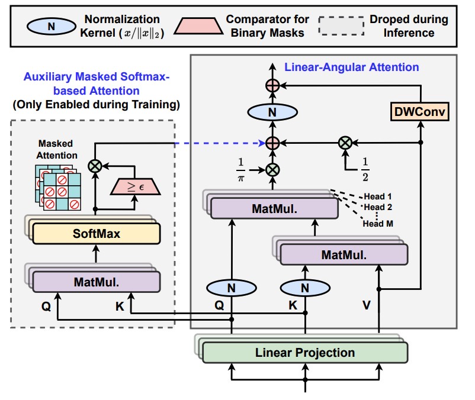

# Castling-ViT: Compressing Self-Attention via Switching Towards Linear-Angular Attention During Vision Transformer Inference

[](https://opensource.org/licenses/Apache-2.0)

Haoran You, Yunyang Xiong, Xiaoliang Dai, Bichen Wu, Peizhao Zhang, Haoqi Fan, Peter Vajda, Yingyan Lin

Accepted by [**CVPR 2023**](https://cvpr2023.thecvf.com/). More Info:
\[ [**Paper**](https://arxiv.org/abs/2211.10526) | [**Slide**]() | [**Youtube**]() | [**Github**](https://github.com/GATECH-EIC/Castling-ViT/) \]

---

This is supposed to be an unofficial release of miniature code to reveal the core implementation of our attention block. The final adopted attention block is in a [MultiScaleAttention](https://github.com/facebookresearch/mvit/blob/main/mvit/models/attention.py#L93) format.

<p align="center">
    
</p>

Here are some general guidances for reproducing results reported in our paper.

* For classification task, we build our codebase on top of [MobileVision@Meta](https://github.com/facebookresearch/mobile-vision).

* For segmentation task, we build our codebase on top of [Mask2Former](https://github.com/facebookresearch/Mask2Former), where the unsupervised pretrained models are trained using the [MAE](https://github.com/facebookresearch/mae) framework.

* For detection task, we build our codebase on top of [PicoDet@PaddleDet](https://github.com/PaddlePaddle/PaddleDetection/tree/release/2.6/configs/picodet) and its [PyTorch version](https://github.com/Bo396543018/Picodet_Pytorch). The supervised pretrained models are trained using the [LeViT](https://github.com/facebookresearch/LeViT) framework.


To facilitate the usage in our research community, I am working on translating some of the highly coupled codes to standalone version. Ideally, the detection codebase can be exptected later, stay tuned.

---

## Citation

If you find this codebase is useful for your research, please cite:

````
@inproceedings{you2023castling,
  title={Castling-ViT: Compressing Self-Attention via Switching Towards Linear-Angular Attention During Vision Transformer Inference},
  author={You, Haoran and Xiong, Yunyang and Dai, Xiaoliang and Wu, Bichen and Zhang, Peizhao and Fan, Haoqi and Vajda, Peter and Lin, Yingyan},
  booktitle={The IEEE/CVF Conference on Computer Vision and Pattern Recognition (CVPR 2023)},
  year={2023}
}
````
